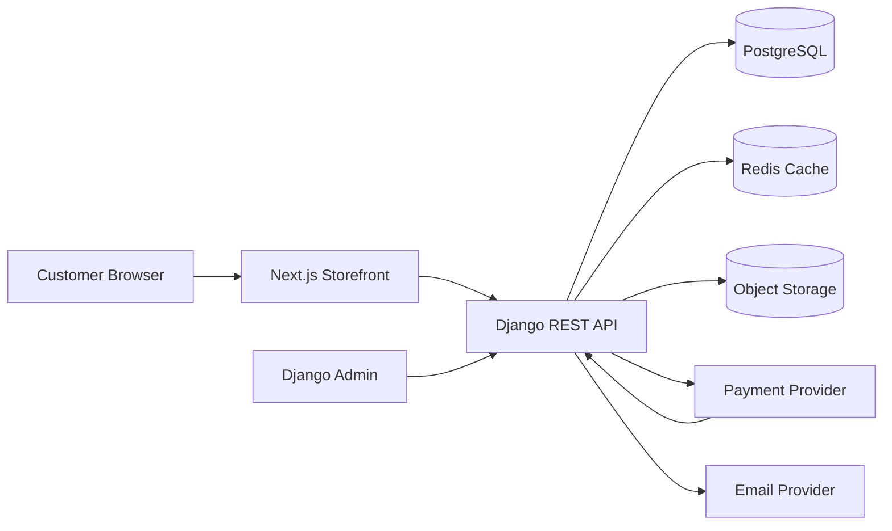

# Apple Device Store System Design

## 1. Purpose

This document defines the structure for a simple ecommerce store selling Apple devices and accessories. The system uses:

- **Next.js** for the storefront and customer experience
- **Django + Django REST Framework** for the backend API and administration
- **PostgreSQL** for persistent data
- **Object storage** for product images
- **Stripe or an equivalent payment provider** for checkout payments

The first release should be a modular monolith: one Django service and one Next.js application, with well-defined modules and API contracts.

## 2. Goals and Scope

### Goals

- Browse Apple products by category
- Search, filter, and sort products
- View product details, images, variants, and stock status
- Manage a shopping cart
- Register, sign in, and manage customer details
- Complete checkout and receive an order confirmation
- Allow staff to manage products, inventory, orders, and promotions
- Provide a responsive, accessible storefront

### Initial non-goals

- Marketplace sellers
- Product configurator for custom Apple builds
- Multi-warehouse fulfillment
- Native mobile applications
- International tax and currency support
- Advanced recommendation or personalization systems

## 3. High-Level Architecture



### Request flow

1. The browser requests pages from Next.js.
2. Next.js fetches catalog and account data from Django over HTTPS.
3. Django validates permissions and business rules.
4. Django reads and writes PostgreSQL data.
5. Product images are served from object storage through a CDN.
6. Payment confirmation is received through a signed provider webhook.
7. Django updates the order and sends a confirmation email.

## 4. Repository Structure

A monorepo is recommended for the initial project:

```text
store/
├── apps/
│   ├── web/                         # Next.js application
│   │   ├── app/
│   │   │   ├── (store)/
│   │   │   │   ├── page.tsx         # Home/catalog landing page
│   │   │   │   ├── products/page.tsx
│   │   │   │   ├── products/[slug]/page.tsx
│   │   │   │   ├── cart/page.tsx
│   │   │   │   ├── checkout/page.tsx
│   │   │   │   └── orders/[id]/page.tsx
│   │   │   ├── account/
│   │   │   └── api/                 # Optional thin BFF routes
│   │   ├── components/
│   │   ├── lib/
│   │   │   ├── api-client.ts
│   │   │   ├── auth.ts
│   │   │   └── formatting.ts
│   │   └── tests/
│   └── api/                         # Django project
│       ├── config/                  # settings, URLs, WSGI/ASGI
│       ├── apps/
│       │   ├── accounts/
│       │   ├── catalog/
│       │   ├── cart/
│       │   ├── orders/
│       │   ├── payments/
│       │   └── promotions/
│       ├── requirements/
│       └── tests/
├── packages/
│   └── contracts/                   # OpenAPI-generated types or shared schemas
├── infra/
│   ├── docker-compose.yml
│   └── deployment/
├── .env.example
└── README.md
```

## 5. Frontend Design

### Rendering strategy

- Use **Server Components** for catalog and product pages where SEO matters.
- Use **Client Components** for cart controls, filters, forms, and interactive checkout steps.
- Use route-level loading and error states.
- Revalidate catalog pages after product or inventory changes.
- Keep payment secrets and Django credentials on the server only.

### Main pages

| Route | Purpose |
|---|---|
| `/` | Featured products and categories |
| `/products` | Searchable product catalog |
| `/products/[slug]` | Product details and variant selection |
| `/cart` | Cart contents and quantity management |
| `/checkout` | Address, delivery, and payment flow |
| `/orders/[id]` | Order confirmation and status |
| `/account` | Profile, addresses, and order history |
| `/login` and `/register` | Customer authentication |

### Frontend state

- Server state: fetch from Django using typed API functions.
- Cart state: persist a cart identifier in an HTTP-only cookie; allow anonymous carts.
- Session state: use short-lived access tokens and a secure refresh mechanism, preferably HTTP-only cookies.
- Form state: validate at the UI boundary, then always revalidate in Django.

## 6. Backend Modules

### Accounts

Responsibilities:

- Customer registration and login
- Password reset and email verification
- Customer profile and saved addresses
- Role-based staff permissions

### Catalog

Responsibilities:

- Product categories
- Products and variants
- Product images and specifications
- Published/unpublished status
- Search, filtering, and sorting

### Inventory

Responsibilities:

- Available quantity per variant
- Inventory reservations during checkout
- Stock adjustments and audit records
- Prevent overselling in concurrent checkouts

### Cart

Responsibilities:

- Anonymous and authenticated carts
- Cart lines and quantities
- Price snapshot at checkout
- Cart expiration and merging after login

### Orders

Responsibilities:

- Order creation and state transitions
- Shipping and billing addresses
- Order line snapshots
- Fulfillment and cancellation status
- Customer order history

### Payments

Responsibilities:

- Create payment intents
- Store provider references, not card data
- Validate signed webhooks
- Make webhook processing idempotent
- Update orders only after confirmed payment status

## 7. Core Data Model

### Product

- `id`
- `name`
- `slug`
- `description`
- `category_id`
- `brand`
- `is_published`
- `created_at`
- `updated_at`

### ProductVariant

- `id`
- `product_id`
- `sku`
- `name`
- `price_minor`
- `currency`
- `attributes` JSON, for example storage and color
- `stock_quantity`
- `reserved_quantity`
- `is_active`

### ProductImage

- `id`
- `product_id`
- `variant_id` nullable
- `url`
- `alt_text`
- `sort_order`

### Cart and CartItem

- `Cart`: `id`, `customer_id` nullable, `status`, `expires_at`
- `CartItem`: `cart_id`, `variant_id`, `quantity`, `unit_price_minor`

### Order and OrderItem

- `Order`: `id`, `customer_id`, `status`, `payment_status`, `currency`, `subtotal_minor`, `shipping_minor`, `tax_minor`, `total_minor`, `created_at`
- `OrderItem`: `order_id`, `variant_id`, `sku`, `product_name`, `variant_name`, `quantity`, `unit_price_minor`
- Store product and price snapshots so historical orders do not change when the catalog changes.

### Payment

- `id`
- `order_id`
- `provider`
- `provider_payment_id`
- `status`
- `amount_minor`
- `processed_at`
- `provider_event_id` with a unique constraint for webhook idempotency

## 8. API Contract

Use versioned REST endpoints under `/api/v1/`.

### Public catalog

```text
GET    /api/v1/categories
GET    /api/v1/products
GET    /api/v1/products/{slug}
```

Supported product query parameters:

```text
?q=iphone&category=iphone&min_price=50000&max_price=150000
&sort=price_asc&page=1&page_size=24
```

### Authentication and account

```text
POST   /api/v1/auth/register
POST   /api/v1/auth/login
POST   /api/v1/auth/logout
POST   /api/v1/auth/refresh
GET    /api/v1/account
PATCH  /api/v1/account
GET    /api/v1/account/orders
```

### Cart and checkout

```text
GET    /api/v1/cart
POST   /api/v1/cart/items
PATCH  /api/v1/cart/items/{id}
DELETE /api/v1/cart/items/{id}
POST   /api/v1/checkout/validate
POST   /api/v1/checkout/payment-intent
```

### Orders and payments

```text
GET    /api/v1/orders/{id}
POST   /api/v1/orders/{id}/cancel
POST   /api/v1/payments/webhook
```

### API rules

- Use serializers for input and output validation.
- Return consistent error objects: `{ "code": "...", "message": "...", "fields": {} }`.
- Use pagination for collection endpoints.
- Never trust prices, totals, stock, or discount values sent by the browser.
- Generate an OpenAPI schema and use it to produce TypeScript client types.

## 9. Checkout and Order Lifecycle

```text
CART
  -> VALIDATING
  -> PAYMENT_PENDING
  -> PAID
  -> PROCESSING
  -> SHIPPED
  -> DELIVERED

Payment failure -> PAYMENT_FAILED
Customer cancellation -> CANCELLED
Refund after payment -> REFUNDED
```

Checkout should:

1. Re-fetch product prices and stock.
2. Create short-lived inventory reservations in a database transaction.
3. Calculate subtotal, shipping, tax, discount, and total on the server.
4. Create a payment intent for the server-calculated total.
5. Create or finalize the order after payment confirmation.
6. Release reservations when payment expires or fails.
7. Process provider webhooks idempotently.

## 10. Security Requirements

- Enforce HTTPS outside local development.
- Store secrets in environment variables or a secret manager.
- Use secure, HTTP-only, same-site cookies for sessions or refresh tokens.
- Configure CORS to allow only the deployed Next.js origin.
- Apply Django CSRF protection where cookie-authenticated mutations are used.
- Rate-limit login, registration, password reset, and payment endpoints.
- Validate and sanitize uploaded media metadata.
- Restrict Django admin to staff users with MFA where available.
- Do not store card numbers or CVV data.
- Log security events without logging passwords, tokens, or payment secrets.

## 11. Admin and Operations

Django Admin should support:

- Product and variant management
- Image ordering and publishing
- Stock adjustments
- Order search and status updates
- Customer lookup
- Promotion management
- Audit history for inventory and order changes

Recommended operational additions:

- Structured JSON logs
- Error tracking such as Sentry
- Health endpoints: `/health/live` and `/health/ready`
- Database backups and restore testing
- Background worker for email, reservation expiry, and webhook retries
- Redis-backed task queue such as Celery only when asynchronous work is needed

## 12. Deployment

### Local development

Use Docker Compose for:

- Next.js
- Django
- PostgreSQL
- Redis

### Production

- Deploy Next.js to a Node-compatible hosting platform.
- Deploy Django behind a reverse proxy using Gunicorn or Uvicorn.
- Use managed PostgreSQL and object storage.
- Serve static and media assets through a CDN.
- Run migrations as a controlled release step.
- Keep the API and frontend on separate subdomains or behind one gateway.

Example domains:

```text
https://store.example.com
https://api.example.com
https://admin.example.com
```

## 13. Testing Strategy

### Backend

- Model and serializer tests
- Permission and authentication tests
- API contract tests
- Transaction tests for inventory reservation
- Webhook idempotency tests
- Order state transition tests

### Frontend

- Component tests for cart and checkout controls
- API client tests for success and error responses
- End-to-end tests for browse, login, add-to-cart, checkout, and order confirmation
- Accessibility checks for keyboard navigation, labels, focus, and contrast

### Minimum release scenarios

1. A visitor can browse published products.
2. A visitor can add a product variant to an anonymous cart.
3. A customer can register and retain their cart after login.
4. Checkout rejects stale prices and unavailable stock.
5. A successful payment creates exactly one paid order.
6. A repeated payment webhook does not duplicate an order or charge.
7. Staff can publish a product and update inventory.

## 14. Delivery Phases

### Phase 1: Foundation

- Create monorepo and local Docker setup
- Configure Django, PostgreSQL, Next.js, and environment variables
- Add health checks and CI

### Phase 2: Catalog

- Implement categories, products, variants, images, and inventory
- Add Django Admin management
- Build product listing and detail pages

### Phase 3: Accounts and Cart

- Add authentication and customer profiles
- Implement anonymous and authenticated carts
- Add cart UI and quantity validation

### Phase 4: Checkout and Orders

- Add address collection and server-side totals
- Integrate payment provider
- Implement order states and webhooks
- Add confirmation and order history pages

### Phase 5: Hardening

- Add rate limiting, observability, backups, and accessibility checks
- Run end-to-end tests
- Perform a production deployment rehearsal

## 15. Key Decisions

- The Django API is the source of truth for prices, stock, discounts, order totals, and payment state.
- Next.js owns presentation and user interaction, not business-critical pricing logic.
- PostgreSQL transactions and constraints protect inventory and order integrity.
- Product and order data are separated through immutable order-line snapshots.
- Payment webhooks, inventory reservations, and background jobs must be idempotent.
- The initial architecture remains simple enough for one team to operate and can scale through caching, workers, read replicas, and service extraction later.
